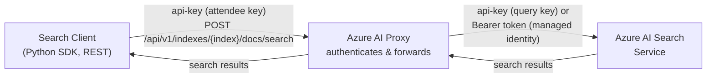

# Azure AI Search

The Azure AI Proxy provides pass-through access to [Azure AI Search](https://learn.microsoft.com/azure/search/search-what-is-azure-search) indexes. This lets workshop attendees query search indexes behind the same API-key authentication used for all other proxy endpoints, without revealing backend service URLs or admin keys.

## How It Works



1. **Client** sends a search request to `https://<proxy-host>/api/v1/indexes/{indexName}/docs/search` with an `api-key` header containing the attendee's proxy API key.
2. **Proxy** validates the attendee API key, looks up the search catalog entry for the event, and forwards the request to the registered Azure AI Search service.
3. **Azure AI Search** receives the request authenticated with either the backend query API key (`api-key` header) or a managed identity Bearer token.
4. **Proxy** returns the search results unchanged to the client.

### Supported URL patterns

| Pattern | Description |
|---------|-------------|
| `POST /api/v1/indexes/{indexName}/docs/search` | Standard REST search query |
| `POST /api/v1/indexes('{indexName}')/docs/search.post.search` | OData-style POST search |

### Authentication

The proxy supports two backend authentication modes for Azure AI Search:

| Mode | Header sent to Search service |
|------|-------------------------------|
| **API Key** (default) | `api-key: <query-api-key>` |
| **Managed Identity** | `Authorization: Bearer <token>` (scope: `https://cognitiveservices.azure.com/.default`) |

The proxy **never** forwards the client's attendee API key to the backend. It replaces it with the catalog's endpoint key or a managed identity token.

## Step 1: Create an Azure AI Search Query Key

For security, use a **read-only Query API Key** rather than an Admin key. A query key allows search queries but cannot modify indexes or data.

1. In the [Azure portal](https://portal.azure.com), navigate to your Azure AI Search service.
2. Go to **Settings** → **Keys**.
3. Copy an existing **Query key**, or create a new one.


## Step 2: Register the Search Service in the Proxy Admin UI

1. Log in to the proxy admin UI.
2. Go to **Resources** → **+ New Resource**.
3. Fill in the fields:

    | Field | Value | Example |
    |-------|-------|---------|
    | **Friendly Name** | A human-readable label | `Product Search Index` |
    | **Deployment Name** | The Azure Search **index name** | `contoso-products` |
    | **Type** | Select **Azure AI Search** | |
    | **Endpoint URL** | The Search service endpoint | `https://mysearch.search.windows.net` |
    | **Key** | The read-only Query API key | The query key from Step 1 |
    | **Use Managed Identity** | Toggle on for token-based auth | |
    | **Region** | Any label | `eastus` |
    | **Active** | Checked | |

4. **Link the catalog to an event**: Edit the event and add the new Azure AI Search catalog so attendees can access it.

!!! note
    The **Deployment Name** must match the Azure Search **index name** exactly. This is what clients use in the URL path: `/api/v1/indexes/{indexName}/docs/search`.

!!! tip
    If using **Managed Identity**, you can leave the **Key** field empty. The proxy will authenticate with a Bearer token instead. See the [Managed Identity guide](managed_identity.md) for RBAC setup.

## Step 3: Query from a Client

### Python SDK

Use the standard Azure AI Search Python SDK — just point the endpoint at the proxy and use the attendee API key as the credential:

```python
import os
from azure.search.documents import SearchClient
from azure.core.credentials import AzureKeyCredential
from azure.search.documents.models import VectorizedQuery

PROXY_ENDPOINT = os.environ["PROXY_ENDPOINT"]  # e.g. https://<proxy-host>/api/v1
API_KEY = os.environ["PROXY_API_KEY"]           # attendee API key
INDEX_NAME = "contoso-products"                 # matches the Deployment Name in the catalog

search_client = SearchClient(
    endpoint=PROXY_ENDPOINT,
    index_name=INDEX_NAME,
    credential=AzureKeyCredential(API_KEY),
)

# Keyword + vector hybrid search with semantic ranking
vector_query = VectorizedQuery(
    vector=embedding,  # your embedding vector
    k_nearest_neighbors=3,
    fields="contentVector",
)

results = search_client.search(
    search_text="wireless headphones",
    vector_queries=[vector_query],
    query_type="semantic",
    semantic_configuration_name="default",
    top=3,
)

for doc in results:
    print(f"{doc['title']} (score: {doc['@search.score']:.2f})")
```

### curl

```bash
curl -X POST "https://<proxy-host>/api/v1/indexes/contoso-products/docs/search" \
  -H "api-key: <your-attendee-api-key>" \
  -H "Content-Type: application/json" \
  -d '{
    "search": "wireless headphones",
    "top": 5,
    "select": "id, title, content"
  }'
```

## Troubleshooting

| Issue | Check |
|-------|-------|
| `401 Unauthorized` from proxy | Verify your `api-key` header matches a valid, active attendee key for an active event |
| `404 Not Found` from proxy | Verify the index name in the URL matches the **Deployment Name** in the catalog, and the catalog is linked to your event |
| `403 Forbidden` from Search | The catalog's **Key** doesn't have query permissions, or managed identity RBAC is not configured |
| `400 Bad Request` from Search | Check the request body matches the [Azure AI Search REST API](https://learn.microsoft.com/azure/search/search-get-started-rest#search-an-index) format |
| Empty results | Verify the index name, field names, and semantic configuration match your search service |
