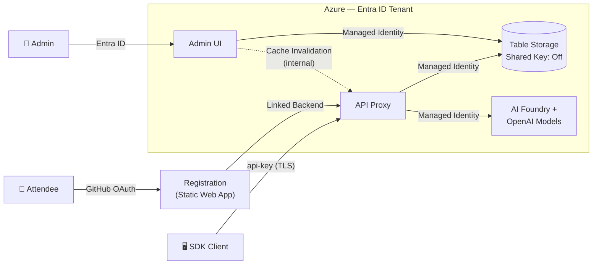
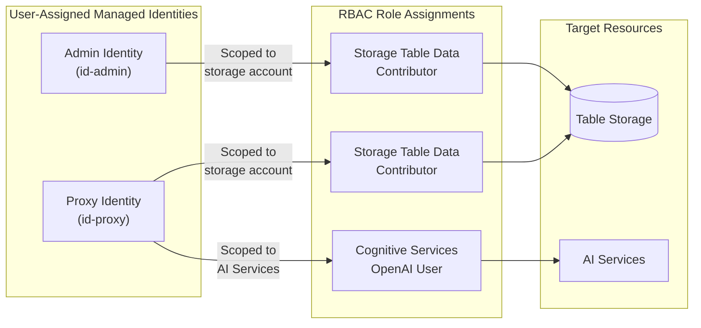
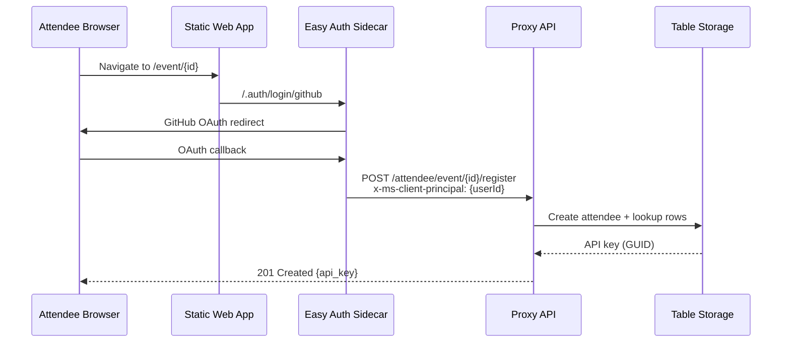
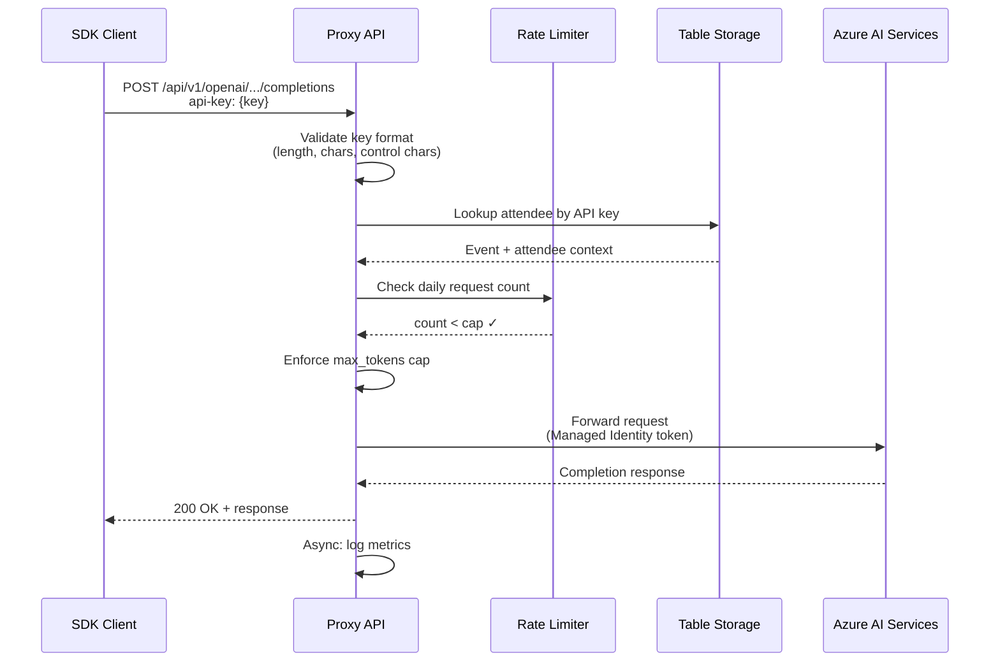
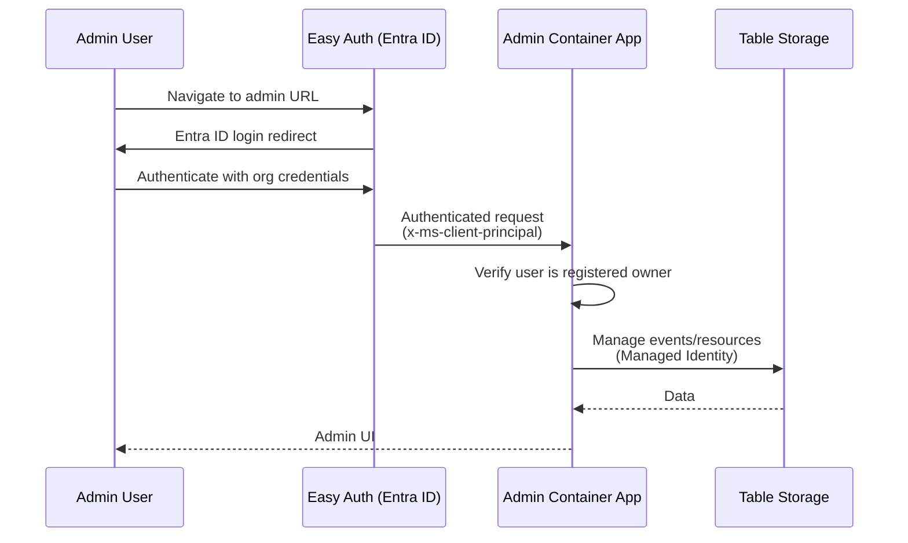

# Security Architecture

This page documents the security architecture of the Azure AI Proxy when deployed to Azure, following least-privilege principles. The deployment is designed for **B2B/enterprise (BAMI) tenants** where Entra ID governs identity and access.

## Architecture overview

## Identity model

All runtime service-to-service communication uses **User-Assigned Managed Identities** scoped via `AZURE_CLIENT_ID`. No shared keys, connection strings, or API keys flow between Azure services.

| Identity | RBAC Role | Scope | Purpose |
|----------|-----------|-------|---------|
| **Proxy** (User-Assigned) | Storage Table Data Contributor | Storage account | Read/write attendees, events, metrics, rate limits |
| **Proxy** (User-Assigned) | Cognitive Services OpenAI User | AI Services account | Forward requests to OpenAI models via managed identity |
| **Admin** (User-Assigned) | Storage Table Data Contributor | Storage account | Manage events, resources, attendees, reporting |

!!! note "Least-privilege design"
    The system-assigned identities on the Container Apps have **no role grants** — only the user-assigned identities carry RBAC permissions. `AZURE_CLIENT_ID` is set explicitly so `DefaultAzureCredential` selects the correct identity at runtime.

## Authentication flows

### Attendee registration (GitHub OAuth)

### API request (SDK client)

### Admin authentication (Entra ID)

## Network and data security

### Storage account hardening

| Setting | Value | Rationale |
|---------|-------|-----------|
| `allowSharedKeyAccess` | `false` | Forces Entra ID authentication only — no connection strings |
| `defaultToOAuthAuthentication` | `true` | Portal defaults to Entra ID instead of key-based auth |
| `publicNetworkAccess` | `Disabled` | No direct internet access to storage |
| `networkAcls.defaultAction` | `Deny` | Deny all network access by default |
| `networkAcls.bypass` | `AzureServices` | Allow trusted Azure services (Container Apps) |
| `minimumTlsVersion` | `TLS1_2` | Enforce modern TLS |

### Container Apps security

| Control | Implementation |
|---------|---------------|
| **Auth sidecar** | Container Apps Easy Auth injects `x-ms-client-principal` headers after authentication. The proxy trusts these headers only when running behind the sidecar. |
| **Internal communication** | Admin-to-proxy cache invalidation uses the Container Apps internal FQDN (`*.internal.{domain}`), not exposed to the internet. |
| **Secret management** | Encryption keys and App Insights connection strings are stored as Container Apps secrets, injected as environment variables. |
| **Constant-time comparisons** | Cache invalidation key and admin local login use `CryptographicOperations.FixedTimeEquals` to prevent timing attacks. |
| **Image pull** | Container Registry images pulled via managed identity (ACR pull role on user-assigned identity). |

### Input validation at auth boundaries

| Attack vector | Mitigation |
|---------------|------------|
| Malformed API keys (short, control chars) | `IsPlausibleApiKey()` rejects before table lookup — returns 401, not 500 |
| Invalid base64 in `x-ms-client-principal` | `TryDecodeClientPrincipal()` with safe fallback — returns 401 |
| Malformed JSON in client principal | `JsonException` caught, logged, returns null — 401 |
| Oversized headers | `MaxClientPrincipalHeaderLength` (16 KB) guard |
| Query parameter injection (MCP routes) | `Uri.EscapeDataString()` on all forwarded query parameters |

### Rate limiting

| Control | Implementation |
|---------|---------------|
| **Daily request cap** | Per-API-key, resets at midnight UTC. Enforced at `>=` cap (not `>`). |
| **Max token cap** | Per-event setting, limits `max_tokens` in each request. |
| **Admin login throttling** | IP-based lockout after failed login attempts. |

## BAMI tenant considerations

When deployed in a BAMI (Business Account Managed Identity) tenant:

1. **Entra ID app registration** — The admin UI registers an app in the tenant for OpenID Connect authentication. Users authenticate with their organizational credentials.
2. **Conditional Access** — Entra ID Conditional Access policies in the BAMI tenant apply to admin logins (MFA, device compliance, location restrictions).
3. **RBAC inheritance** — All role assignments are scoped to the resource group, not the subscription. No subscription-level permissions are granted.
4. **No cross-tenant access** — Storage and AI Services are accessed exclusively via managed identities in the same tenant. No cross-tenant federation is configured.
5. **Audit trail** — All Entra ID authentications and RBAC operations are logged in the tenant's Entra ID sign-in and audit logs. Application-level metrics flow to Application Insights.

## Secrets inventory

| Secret | Where stored | Rotation |
|--------|-------------|----------|
| Encryption key | Container Apps secret (derived from `uniqueString`) | Redeployed with `azd up` |
| App Insights connection string | Container Apps secret | Managed by Azure |
| Entra ID client credentials | Entra ID app registration | Managed by Entra ID |
| Attendee API keys | Table Storage (GUID per attendee) | Per-event, time-bound by event window |

!!! warning "No long-lived secrets"
    Storage connection strings are **not used**. The `allowSharedKeyAccess: false` setting ensures no key-based access exists. All service-to-service auth uses short-lived managed identity tokens.
